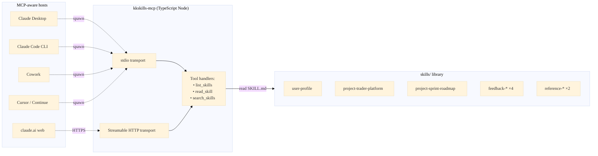
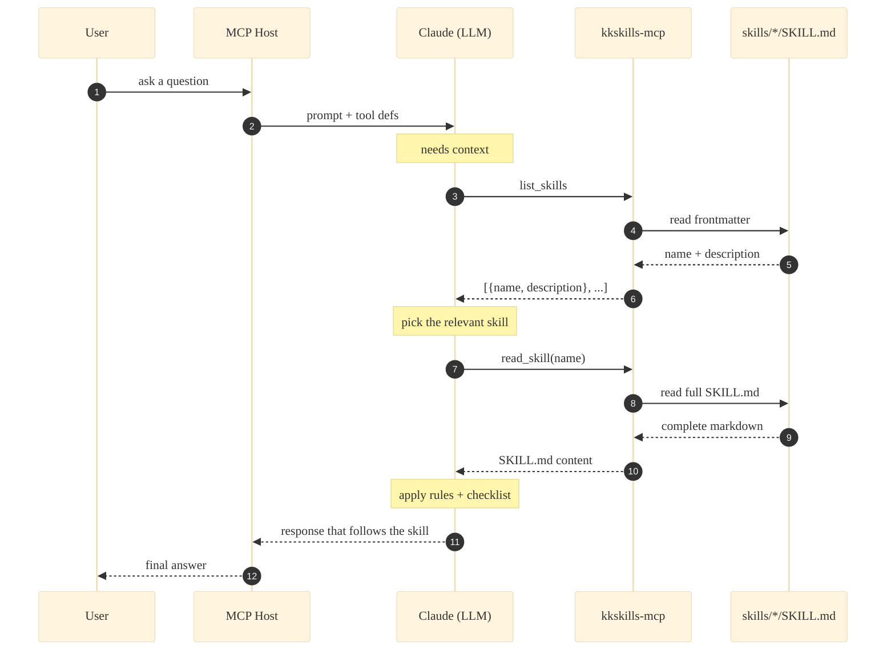

# claude-mcp-kkskills


A personal Claude skill library exposed as an MCP server (stdio + Streamable HTTP) — **also usable as a template** for building your own skill library.

The repo holds two things:

1. **A skill library** under `skills/` — one folder per skill, each containing a `SKILL.md` that defines triggers, process steps, rules, and examples. The shipped set is the author's working library; treat it as **reference / starter examples** if you're forking.
2. **A stdio + HTTP MCP server** under `mcp-server/` — a TypeScript Node server that exposes the skills as discoverable tools to any MCP-aware host (Claude Desktop, Claude Code CLI, Cowork, Cursor, claude.ai remote connectors, etc.).

## At a glance

- **What it is** — a personal Claude skill library + an MCP server that makes it protocol-addressable. Doubles as a **template scaffold** for your own library.
- **Who it's for** — anyone who wants Claude (Desktop / Code / Cowork / Cursor / claude.ai) to load a consistent set of skills across every session, version-controlled in one repo. Forkers wanting a ready-made structure to drop their own skills into.
- **Skills shipped** — **9**, organised by prefix: `user-` (1) · `project-` (2) · `feedback-` (4) · `reference-` (2). These are the author's working set — keep, edit, or wipe as you like (see [Use as a template](#use-as-your-own-skill-library-template)).
- **Transports** — `stdio` for local hosts that spawn a subprocess, `Streamable HTTP` for remote connectors (claude.ai, CI, multi-user).
- **Runtime** — Node ≥ 18, TypeScript, MCP SDK `^1.0.4`. Docker image + compose file included.
- **No host config drift** — the library grows by adding folders under `skills/`; hosts only point at the server once.

**60-second start** (stdio + Claude Desktop):

```bash
cd mcp-server && npm install && npm run build
```

Then add to `claude_desktop_config.json` and restart:

```json
"kkskills": {
  "command": "node",
  "args": ["/absolute/path/to/mcp-server/dist/index.js"]
}
```

Need HTTP, Docker, or a remote connector instead? Jump to [Quick start](#quick-start-5-steps).

## Install as a Claude Code plugin (marketplace)

This repo doubles as a [Claude Code plugin marketplace](https://code.claude.com/docs/en/plugin-marketplaces). The marketplace ships **only the generic, reusable skills** as a single plugin (`kkskills-essentials`); the MCP server above still serves the **full** library, including the project-specific skills.

```shell
# add this repo as a marketplace, then install the plugin
/plugin marketplace add kktest/claude-mcp-kkskills
/plugin install kkskills-essentials@kkskills
```

The plugin bundles 8 skills: `feedback-additive-changes`, `feedback-migrations-additive-first`, `feedback-no-duplicate-docs`, `feedback-use-full-filenames`, `feedback-verify-with-real-data`, `reference-clean-architecture`, `reference-conventional-commits`, `user-profile`. Once installed they're invocable namespaced as `kkskills-essentials:<skill>`.

Two delivery channels, one source of truth:

| Channel | What it serves | How |
|---------|----------------|-----|
| **MCP server** (`mcp-server/`) | all 16 skills in `skills/` | `list_skills` / `read_skill` tools |
| **Plugin marketplace** (`.claude-plugin/`) | the 8 generic skills | native `/plugin install` |

The marketplace files (`.claude-plugin/marketplace.json` + `plugins/kkskills-essentials/`) reference the canonical skill folders via **symlinks**, so there is no second copy to keep in sync. Validate locally with `claude plugin validate .`.

## Why

Skills as flat files only help if a host knows where to look. The MCP server makes them protocol-addressable: a host calls `list_skills`, picks the relevant one, calls `read_skill`, and applies the content. The library can grow without changing host configuration.

## How it fits together



And the runtime call sequence on every user prompt:



> Full hand-tuned SVG / PNG versions of both diagrams live in [`diagrams/`](./diagrams/) — useful for slide decks, blog posts, and social.

## What's in the library

> The table below is the **author's working set**. If you forked this repo as a template, treat these as starter examples — they show the shape, naming, and tone a skill should take. See [Use as a template](#use-as-your-own-skill-library-template) for how to swap them for your own.

| Skill                                  | When it applies                                                     |
|----------------------------------------|---------------------------------------------------------------------|
| `user-profile`                         | Calibrating tone, register, response style.                          |
| `project-trader-platform`              | Working in the trader-platform project context.                      |
| `project-sprint-roadmap`               | Scoping/planning re-architecture work.                               |
| `feedback-no-duplicate-docs`           | Avoiding parallel tracking docs (CHECKLIST/TODO/TESTING drift).      |
| `feedback-use-full-filenames`          | Referencing dated project docs unambiguously.                        |
| `feedback-verify-with-real-data`       | Grounding claims in grep/probe, not assumption.                      |
| `feedback-additive-changes`            | Refactors stay additive; legacy code stays dormant, not deleted.     |
| `feedback-migrations-additive-first`   | DB schema changes via expand-contract — never add+tighten+drop in one. |
| `reference-trader-platform-layout`     | File paths, naming conventions, deploy commands.                     |
| `reference-external-providers`         | External API rate limits, plan tiers, quirks.                        |
| `reference-clean-architecture`         | Layering rules + per-stack boundary tools (Python/TS/Java/Go).       |
| `reference-conventional-commits`       | Commit message / PR title / changelog format.                        |

See `CLAUDE.md` for the maintenance rules — when to update an existing skill vs. add a new one — and `SKILL_TEMPLATE.md` for the structure each skill follows.

---

## Use as your own skill library template

This repo is structured so that a fork can keep the **infrastructure** (MCP server, transport modes, Docker bring-up, host wiring instructions, template, decision-rule docs) and replace the **content** (the skills themselves, the project-specific quick-reference) without touching anything else.

### What's generic (keep as-is)

- `mcp-server/` — the TypeScript stdio + HTTP server. No project-specific code; reads whatever lives under `skills/`.
- `Dockerfile`, `docker-compose.yml`, `.dockerignore`, `.env.example` — runtime packaging.
- `SKILL_TEMPLATE.md` — starter for every new skill, with the prefix convention documented inline.
- `CLAUDE.md` — generic maintenance rules (decision loop, file structure, restart procedure).
- This README's transport / wiring sections.

### What's the author's (swap for your own)

- Everything under `skills/` — the 9 shipped folders are the author's working set. Wipe, edit, or keep as starter examples.
- `CLAUDE.local.md` — the author's project-specific quick-reference (skill inventory, codebase shortcuts). **Gitignored**, so it doesn't follow forks. Use `CLAUDE.local.md.example` to bootstrap your own.
- This README's `## What's in the library` table — replace with your own skill list when you wipe `skills/`.

### Fork checklist

1. **Clone & rename**
   ```bash
   git clone https://github.com/<author>/claude-mcp-kkskills.git my-skills
   cd my-skills
   git remote remove origin
   # optionally update package.json `name` and the badge in README.md
   ```
2. **Decide what to do with the shipped skills**
   - **Keep as reference** — leave `skills/` alone for now, add your own folders alongside.
   - **Wipe and start fresh** — `rm -rf skills/* && touch skills/.gitkeep`. Server will boot with 0 skills, `/healthz` will confirm.
3. **Bootstrap your local context file**
   ```bash
   cp CLAUDE.local.md.example CLAUDE.local.md
   # fill in your skill inventory + codebase shortcuts
   ```
4. **Update README content (not infrastructure)**
   - `## What's in the library` table → your skills (or remove if `skills/` is empty).
   - `skills-N` badge at the top → your count (or remove).
   - `## At a glance` → adjust voice/focus if you want, the structure stays.
5. **Add your first skill**
   ```bash
   mkdir -p skills/my-first-skill
   cp SKILL_TEMPLATE.md skills/my-first-skill/SKILL.md
   # edit frontmatter + sections per CLAUDE.md decision rule
   ```
6. **Build, smoke-test, wire to host** — follow [Quick start](#quick-start-5-steps) from Step 2 onward; nothing else changes for a fork.

### Sensitive content

`CLAUDE.local.md` is gitignored so personal/project context doesn't leak into a public fork. Anything that should stay private (internal paths, project codenames you don't want in git history, team-only shortcuts) belongs there, not in `CLAUDE.md` or in skill files. The `.gitignore` rule (`CLAUDE.local.md` + `!CLAUDE.local.md.example`) lets the template stub commit while keeping your filled-in version local.

---

## Quick start (5 steps)

### Step 1 — Clone & install

```bash
git clone https://github.com/<your-username>/claude-mcp-kkskills.git
cd claude-mcp-kkskills/mcp-server
npm install
```

### Step 2 — Build

```bash
npm run build          # compiles src/ → dist/
```

Output: `dist/index.js` (executable Node script).

### Step 3 — Smoke test locally

```bash
# stdio (default) — answers initialize + tools/list over stdin/stdout
node dist/index.js --help

# HTTP — boot on 127.0.0.1:3030, hit /healthz to verify
node dist/index.js --http &
curl http://127.0.0.1:3030/healthz
# → ok / loaded 9 skill(s)
kill %1
```

### Step 4 — Wire into your host (pick one)

- **Docker (HTTP, no Node install required)** → [section below](#run-with-docker-http-mode)
- **Claude Desktop** → [section below](#wire-into-claude-desktop-macos--windows)
- **Claude Code (CLI)** → [section below](#wire-into-claude-code-cli)
- **Cowork** → [section below](#cowork)
- **Cursor / Continue.dev** → [section below](#cursor--continuedev)
- **claude.ai web (remote connector)** → [section below](#claudeai-web-remote-connector)

### Step 5 — Verify in the host

After restarting the host, ask: *"List the available kkskills and read 'feedback-additive-changes' for me."* The host should call `list_skills` then `read_skill` and return the full file content.

---

## Transport modes & precedence

| Mode           | When to use                                                          |
|----------------|----------------------------------------------------------------------|
| `stdio` (default) | Local hosts that spawn the server as a subprocess: Claude Desktop, Claude Code, Cowork, Cursor. |
| `http` (Streamable HTTP) | Remote hosts that connect over the network: claude.ai custom connectors, CI pipelines, multi-user setups. |

### Configuration — flag wins over env

The server reads its transport / port / host / skills-root from CLI flags first, then env vars, then defaults. CLI flag always wins when both are set.

| Flag              | Env var               | Default                | Purpose                  |
|-------------------|-----------------------|------------------------|--------------------------|
| `--stdio`         | `KKSKILLS_TRANSPORT`  | `stdio`                | Force stdio              |
| `--http`          | `KKSKILLS_TRANSPORT=http` | `stdio`            | Switch to HTTP           |
| `--port <n>`      | `KKSKILLS_PORT`       | `3030`                 | HTTP listen port         |
| `--host <h>`      | `KKSKILLS_HOST`       | `127.0.0.1`            | HTTP bind address        |
| `--skills <path>` | `KKSKILLS_ROOT`       | `<repo>/skills`        | Skills root directory    |
| `--help`          | —                     | —                      | Print usage              |

Examples:

```bash
node dist/index.js                                   # stdio
node dist/index.js --http --port 4000                # HTTP on 127.0.0.1:4000
KKSKILLS_TRANSPORT=http node dist/index.js           # HTTP via env
KKSKILLS_TRANSPORT=http node dist/index.js --stdio   # flag wins → stdio
```

---

## Run with Docker (HTTP mode)

The fastest way to run the HTTP transport without installing Node locally. The compose file binds host port `3030` and mounts your local `skills/` read-only so edits don't need a rebuild.

### Step 1 — Copy the env template (optional)

```bash
cp .env.example .env
# edit .env to change KKSKILLS_PORT, KKSKILLS_HOST, etc.
```

If you skip this, the compose file falls back to its built-in defaults (`KKSKILLS_PORT=3030`, `KKSKILLS_HOST=0.0.0.0`, transport `http`).

### Step 2 — Build & start

```bash
docker compose up -d --build
```

### Step 3 — Verify

```bash
curl http://127.0.0.1:3030/healthz
# → ok / loaded N skill(s)

curl -s -X POST http://127.0.0.1:3030/mcp \
  -H "Content-Type: application/json" \
  -H "Accept: application/json, text/event-stream" \
  -d '{"jsonrpc":"2.0","id":1,"method":"tools/list"}' | head -c 400
```

### Step 4 — Wire your host

Point any MCP host that supports remote connectors at `http://127.0.0.1:3030/mcp` (or your tunnel/public URL for claude.ai — see [claude.ai web](#claudeai-web-remote-connector)).

### Step 5 — Logs / stop

```bash
docker compose logs -f kkskills-mcp
docker compose down
```

### Iterating on skills without rebuilding

The compose file mounts `./skills` over the image's baked-in copy:

```yaml
volumes:
  - ./skills:/app/skills:ro
```

Edit a `SKILL.md`, then restart the container to reload (skills are read at startup, not per-request):

```bash
docker compose restart kkskills-mcp
```

### Run without compose

The image works standalone:

```bash
docker build -t kkskills-mcp:latest .
docker run --rm -p 3030:3030 \
  -v "$(pwd)/skills:/app/skills:ro" \
  kkskills-mcp:latest
```

### Files

| File                | Purpose                                                                    |
|---------------------|----------------------------------------------------------------------------|
| `Dockerfile`        | 3-stage build (build → prod-deps → runtime). Final image ≈ Node alpine + dist + prod deps + skills. |
| `docker-compose.yml`| HTTP service with healthcheck, port mapping, env_file, volume mount.       |
| `.dockerignore`     | Keeps `node_modules/`, `dist/`, `.git/`, `.env` out of the build context.  |
| `.env.example`      | Documents every `KKSKILLS_*` env var — copy to `.env` for local overrides. |

---

## Wire into Claude Desktop (macOS / Windows)

Edit `~/Library/Application Support/Claude/claude_desktop_config.json` (macOS) or `%APPDATA%\Claude\claude_desktop_config.json` (Windows):

```json
{
  "mcpServers": {
    "kkskills": {
      "command": "node",
      "args": [
        "/absolute/path/to/claude-mcp-kkskills/mcp-server/dist/index.js"
      ]
    }
  }
}
```

Restart Claude Desktop. The three tools (`list_skills`, `read_skill`, `search_skills`) appear under the `kkskills` server in the tool inspector.

---

## Wire into Claude Code (CLI)

The `claude` CLI ships with built-in MCP management. Add the server with one command:

```bash
# user scope = available in all your projects
claude mcp add --scope user kkskills -- node /absolute/path/to/claude-mcp-kkskills/mcp-server/dist/index.js

# OR project scope = creates .mcp.json in the current repo (commit it to share with the team)
claude mcp add --scope project kkskills -- node /absolute/path/to/claude-mcp-kkskills/mcp-server/dist/index.js

# OR local scope (default) = only in the current repo, not committed
claude mcp add kkskills -- node /absolute/path/to/claude-mcp-kkskills/mcp-server/dist/index.js
```

Verify:

```bash
claude mcp list
# kkskills: node /absolute/path/... — Connected
```

In a `claude` session, the tools are now callable. Ask: *"Use kkskills.list_skills to show me what's available."*

If you'd rather edit the config directly, the user-scope file is `~/.claude.json` and the project-scope file is `<repo>/.mcp.json`. Same shape as the Claude Desktop config:

```json
{
  "mcpServers": {
    "kkskills": {
      "command": "node",
      "args": ["/absolute/path/to/dist/index.js"]
    }
  }
}
```

To remove later: `claude mcp remove kkskills`.

---

## Cowork

Open Cowork → Settings → MCP servers → Add:

- **Name:** `kkskills`
- **Command:** `node`
- **Args:** `["/absolute/path/to/claude-mcp-kkskills/mcp-server/dist/index.js"]`

Save and reload Cowork. The tools surface under the `kkskills` server.

---

## Cursor / Continue.dev

Add the same MCP block as Claude Desktop to your editor's MCP config:

- **Cursor:** `~/.cursor/mcp.json` (global) or `.cursor/mcp.json` (project)
- **Continue.dev:** `~/.continue/config.json` under `mcpServers`

Restart the editor.

---

## claude.ai web (remote connector)

`claude.ai` cannot spawn local processes, so stdio mode won't work — the server must run in **HTTP mode** with a public URL.

### Local-only (for testing with a tunneling tool)

```bash
node dist/index.js --http --port 3030
# in another terminal:
cloudflared tunnel --url http://127.0.0.1:3030
# or: ngrok http 3030
```

### Production (deploy somewhere)

Deploy the built `mcp-server/` directory to a Node-friendly host (Fly.io / Railway / Render / a small VPS). Bind to `0.0.0.0` and a port the platform exposes:

```bash
node dist/index.js --http --host 0.0.0.0 --port 8080
```

Then in claude.ai → Settings → Connectors → Add custom connector:

- **URL:** `https://your-deployment.example.com/mcp`
- **Transport:** Streamable HTTP

Test from the CLI before wiring up the UI:

```bash
curl -s https://your-deployment.example.com/healthz
curl -s -X POST https://your-deployment.example.com/mcp \
  -H "Content-Type: application/json" \
  -H "Accept: application/json, text/event-stream" \
  -d '{"jsonrpc":"2.0","id":1,"method":"initialize","params":{"protocolVersion":"2024-11-05","capabilities":{},"clientInfo":{"name":"test","version":"0.0.1"}}}'
```

---

## Add a new skill

1. **Read `CLAUDE.md` first** — most patterns belong in an existing skill, not a new one.
2. Copy `SKILL_TEMPLATE.md` → `skills/<kebab-name>/SKILL.md` and fill it in.
3. Rebuild and restart:
   ```bash
   cd mcp-server && npm run build
   ```
4. Restart the host so it re-spawns the server (or hit `/healthz` to confirm the count went up if you're in HTTP mode and reloaded the process).

## Update an existing skill

1. `Edit` the relevant `skills/<name>/SKILL.md` section.
2. If triggers change, update the `description` field in the frontmatter.
3. Rebuild and restart as above.

---

## Layout

```
claude-mcp-kkskills/
├── skills/
│   ├── user-profile/SKILL.md
│   ├── project-trader-platform/SKILL.md
│   ├── project-sprint-roadmap/SKILL.md
│   ├── feedback-no-duplicate-docs/SKILL.md
│   ├── feedback-use-full-filenames/SKILL.md
│   ├── feedback-verify-with-real-data/SKILL.md
│   ├── feedback-additive-changes/SKILL.md
│   ├── reference-trader-platform-layout/SKILL.md
│   └── reference-external-providers/SKILL.md
├── mcp-server/
│   ├── src/index.ts
│   ├── package.json
│   ├── tsconfig.json
│   └── README.md
├── diagrams/                # Mermaid source + hand-tuned SVG
│   ├── sequence-flow.mmd
│   ├── sequence-flow.svg
│   ├── architecture.mmd
│   ├── architecture.svg
│   └── README.md
├── Dockerfile               # 3-stage build for HTTP container
├── docker-compose.yml       # one-command HTTP bring-up
├── .dockerignore
├── .env.example             # copy to .env to override KKSKILLS_* vars
├── SKILL_TEMPLATE.md        # starter for every new skill
├── CLAUDE.md                # generic maintenance rules (committed)
├── CLAUDE.local.md          # your project-specific quick-reference (gitignored)
├── CLAUDE.local.md.example  # template stub for the file above
├── README.md
└── .gitignore
```

## License

MIT.
